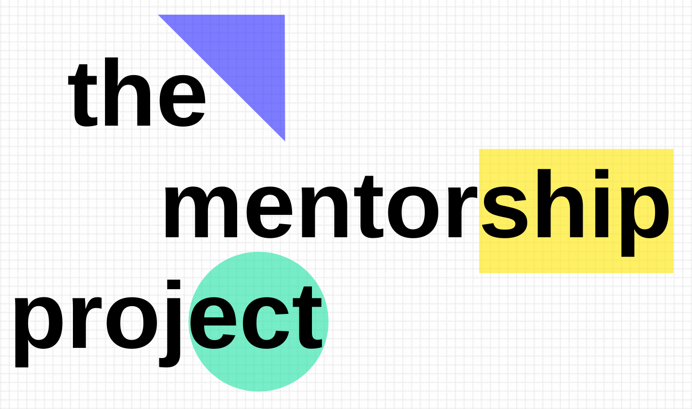

<p align="center">
  <a href="https://thementorshipproject.us">
    
  </a>
</p>
<h1 align="center">
  The Mentorship Project Website
</h1>

Website: <a href="https://thementorshipproject.us">https://thementorshipproject.us</a>. Written in React using GatsbyJS and Bulma CSS, hosted on Netlify.

## Requirements

- React
- Gatsby
- Bulma

## 🚀 Quick start

1.  **Clone the repo**

    ```shell
    git clone https://github.com/godith0/the-mentorship-project-website.git
    ```

1.  **Start developing.**

    Navigate into your new site’s directory and start it up.

    ```shell
    cd the-mentorship-project-website/
    gatsby develop
    ```

1.  **Open the source code and start editing!**

    Your site is now running at `http://localhost:8000`!

    _Note: You'll also see a second link: _`http://localhost:8000/___graphql`_. This is a tool you can use to experiment with querying your data. Learn more about using this tool in the [Gatsby tutorial](https://www.gatsbyjs.org/tutorial/part-five/#introducing-graphiql)._

    Open the `the-mentorship-project-us` directory in your code editor of choice and edit `src/pages/index.js`. Save your changes and the browser will update in real time!
    
## ⚙️ How It Works

The project is primarily located in the `/src/` folder. When loading the site, Gatsby loads the `src/pages/index.js.` file by default. For this simple site, there are no other routes. When the index file is loaded, it sets a header and footer using `/src/components/header.js` and `src/components/footer.js`, respectively. It also sends the component for three tabs ("Past Batch", "About Us", and "Next Batch") and to both header and footer. Finally, it loads whatever page is being viewed (by default, that's the "Past Batch"). When the user switches tabs, React will load the new page and re-render.

## 💫 Deploy

[](https://app.netlify.com/start/deploy?repository=https://github.com/gatsbyjs/gatsby-starter-default)
